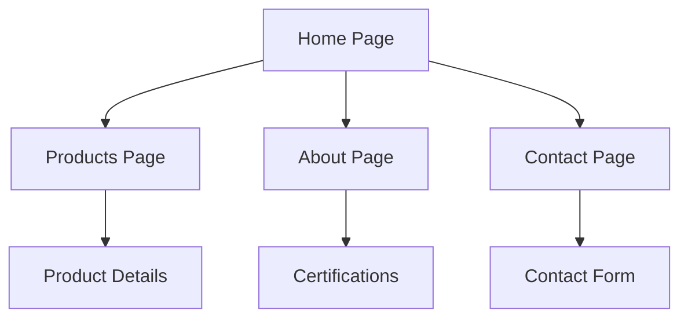

## 1. Product Overview

Tintas Maza é uma empresa brasileira com 27 anos de mercado, especializada na fabricação de tintas imobiliárias, automotivas, industriais e solventes. O site institucional visa apresentar a empresa, seus produtos e valores, com foco na qualidade e sustentabilidade.

O projeto visa transformar o design do Figma em um site moderno usando Next.js, começando pela seção hero (D1) da homepage com vídeo de background.

## 2. Core Features

### 2.1 User Roles
| Role | Registration Method | Core Permissions |
|------|---------------------|------------------|
| Visitor | No registration required | Browse all content, view products |
| Admin | Backend authentication | Manage content, products, videos |

### 2.2 Feature Module

O site institucional Tintas Maza consiste nas seguintes páginas principais:
1. **Home page**: hero section com vídeo, navegação, apresentação da empresa.
2. **Products page**: listagem de produtos por categoria (imobiliária, automotiva, industrial).
3. **About page**: história da empresa, certificações, valores.
4. **Contact page**: informações de contato, formulário, localização.

### 2.3 Page Details
| Page Name | Module Name | Feature description |
|-----------|-------------|---------------------|
| Home page | Hero section (D1) | Exibir vídeo de background com sobreposição de conteúdo da empresa, título principal e call-to-action. |
| Home page | Navigation | Menu superior com links para seções principais do site. |
| Home page | Company presentation | Seção com texto institucional e valores da Maza. |
| Products page | Product categories | Exibir produtos organizados por linhas (imobiliária, automotiva, industrial). |
| Products page | Product details | Cada produto deve mostrar nome, descrição, aplicabilidade e características. |
| About page | Company history | Texto sobre os 27 anos de mercado e evolução da empresa. |
| About page | Certifications | Mostrar selos ISO 9001, ABRAFATI, Coatings Care, PBQP-H. |
| Contact page | Contact form | Formulário para envio de mensagens com campos nome, email, telefone e mensagem. |
| Contact page | Location | Mapa com endereço da fábrica em Mococa-SP. |

## 3. Core Process

### Visitor Flow
1. Usuário acessa a homepage
2. Visualiza hero section com vídeo institucional
3. Navega pelo menu para explorar produtos, sobre ou contato
4. Pode visualizar todas as informações sem cadastro

### Admin Flow
1. Admin faz login no painel administrativo
2. Gerencia conteúdo das páginas
3. Atualiza vídeos e imagens do hero section
4. Gerencia produtos e categorias

## 4. User Interface Design

### 4.1 Design Style
- **Primary colors**: Azul institucional (baseado na marca Maza)
- **Secondary colors**: Branco, cinza e tons de destaque
- **Button style**: Modernos com bordas arredondadas e efeitos hover
- **Font**: Família sans-serif moderna, legível
- **Layout style**: Hero section full-width com navegação fixa no topo
- **Icons**: Estilo clean e minimalista, focando em produtos químicos/pintura

### 4.2 Page Design Overview
| Page Name | Module Name | UI Elements |
|-----------|-------------|-------------|
| Home page | Hero section (D1) | Vídeo full-screen como background, overlay escuro para legibilidade, título principal em destaque, botão CTA, navegação superior transparente. |
| Home page | Navigation | Menu horizontal com logo Maza, links para seções, design clean e profissional. |
| Products page | Product grid | Cards organizados em grid responsivo, imagens de produtos, descrições concisas. |
| About page | Content sections | Layout com imagens e textos alternados, timeline da empresa. |
| Contact page | Form layout | Formulário centralizado com campos claramente identificados. |

### 4.3 Responsiveness
- **Desktop-first**: Design otimizado para desktop com adaptação mobile
- **Breakpoints**: Tablet (768px) e Mobile (375px)
- **Touch interaction**: Botões e links com área de toque adequada
- **Video hero**: Fallback para imagem em dispositivos móveis

### 4.4 Video Background Guidance
- **Environment**: Vídeo institucional mostrando fábrica, produtos ou aplicações
- **Lighting**: Natural e profissional, destacando qualidade dos produtos
- **Duration**: Curto (10-15 segundos) em loop suave
- **Fallback**: Imagem estática para dispositivos móveis e conexões lentas
- **Overlay**: Gradiente escuro sobre o vídeo para garantir legibilidade do texto