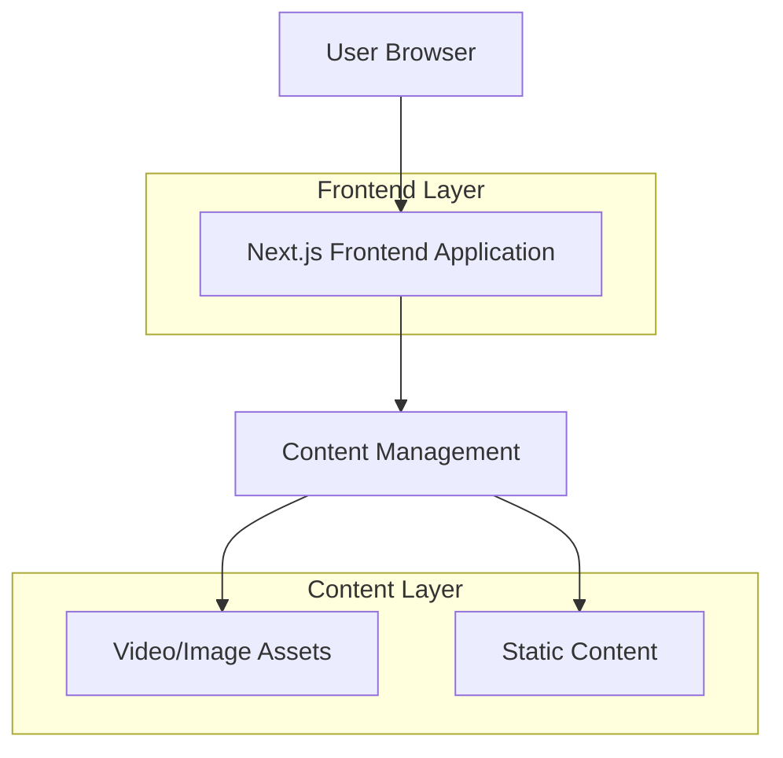

## 1. Architecture design



## 2. Technology Description

- **Frontend**: Next.js@14 + React@18 + TypeScript + Tailwind CSS
- **Initialization Tool**: create-next-app
- **Styling**: Tailwind CSS@3 + PostCSS
- **Video Player**: HTML5 Video API with custom controls
- **Image Optimization**: Next.js Image component
- **Deployment**: Vercel (recommended) ou Netlify
- **Backend**: None (site estático com possível CMS headless futuro)

## 3. Route definitions

| Route | Purpose |
|-------|---------|
| / | Home page, hero section D1 com vídeo background |
| /produtos | Products page, listagem de produtos por categoria |
| /sobre | About page, história e certificações da empresa |
| /contato | Contact page, formulário e informações de contato |

## 4. Component Architecture

### 4.1 Core Components

**HeroSection Component**
```typescript
interface HeroSectionProps {
  videoUrl: string;
  fallbackImage: string;
  title: string;
  subtitle: string;
  ctaText: string;
  ctaLink: string;
}
```

**Navigation Component**
```typescript
interface NavigationProps {
  logo: string;
  items: NavigationItem[];
}

interface NavigationItem {
  label: string;
  href: string;
  isActive?: boolean;
}
```

**VideoBackground Component**
```typescript
interface VideoBackgroundProps {
  src: string;
  poster?: string;
  autoPlay?: boolean;
  muted?: boolean;
  loop?: boolean;
  className?: string;
}
```

## 5. Performance Optimization

### 5.1 Video Optimization
- Compressão de vídeo para WebM e MP4
- Lazy loading com intersection observer
- Fallback para imagem em dispositivos móveis
- Pré-carregamento de poster image

### 5.2 Image Optimization
- Uso do componente Image do Next.js
- WebP format com fallback
- Responsividade automática
- Lazy loading nativo

### 5.3 Bundle Optimization
- Code splitting automático do Next.js
- Tree shaking para remover código não utilizado
- Minificação de CSS e JavaScript
- Gzip/Brotli compression

## 6. SEO Configuration

### 6.1 Meta Tags
```typescript
// app/layout.tsx ou pages/_app.tsx
export const metadata = {
  title: 'Tintas Maza - Paixão por Qualidade',
  description: 'Há 27 anos no mercado, a Tintas Maza se destaca na fabricação de tintas imobiliárias, automotivas, industriais e solventes.',
  keywords: 'tintas, tintas imobiliárias, tintas automotivas, tintas industriais, Maza, Mococa',
  openGraph: {
    title: 'Tintas Maza',
    description: 'Qualidade e inovação em tintas há 27 anos',
    images: ['/og-image.jpg'],
  },
}
```

### 6.2 Structured Data
```typescript
// Schema.org para empresa local
{
  "@context": "https://schema.org",
  "@type": "LocalBusiness",
  "name": "Tintas Maza",
  "description": "Fabricante de tintas imobiliárias, automotivas e industriais",
  "address": {
    "@type": "PostalAddress",
    "streetAddress": "R. José Oleto, 1.140",
    "addressLocality": "Mococa",
    "addressRegion": "SP",
    "postalCode": "13739-070",
    "addressCountry": "BR"
  },
  "telephone": "+55 19 3656-2570"
}
```

## 7. Development Guidelines

### 7.1 Code Structure
```
src/
├── app/                    # Next.js App Router
│   ├── page.tsx           # Home page
│   ├── produtos/page.tsx  # Products page
│   ├── sobre/page.tsx     # About page
│   └── contato/page.tsx   # Contact page
├── components/
│   ├── ui/                # Reusable UI components
│   ├── sections/          # Page sections
│   └── layout/           # Layout components
├── lib/
│   ├── utils/             # Utility functions
│   └── constants/         # App constants
└── public/
    ├── videos/            # Video assets
    └── images/            # Image assets
```

### 7.2 Styling Guidelines
- Tailwind CSS para estilização
- Mobile-first approach
- Componentes reutilizáveis
- Dark overlay para vídeos: `bg-black bg-opacity-50`
- Tipografia responsiva com `text-` utilities

### 7.3 Video Implementation
```typescript
// Video background implementation
<video
  autoPlay
  muted
  loop
  playsInline
  poster="/images/hero-poster.jpg"
  className="absolute inset-0 w-full h-full object-cover"
>
  <source src="/videos/hero-video.webm" type="video/webm" />
  <source src="/videos/hero-video.mp4" type="video/mp4" />
</video>
```

## 8. Deployment Configuration

### 8.1 Vercel Configuration (vercel.json)
```json
{
  "images": {
    "domains": ["maza.com.br"]
  },
  "headers": [
    {
      "source": "/videos/(.*)",
      "headers": [
        {
          "key": "Cache-Control",
          "value": "public, max-age=31536000, immutable"
        }
      ]
    }
  ]
}
```

### 8.2 Environment Variables
```env
NEXT_PUBLIC_SITE_URL=https://tintasmaza.com.br
NEXT_PUBLIC_COMPANY_PHONE=+551936562570
NEXT_PUBLIC_COMPANY_EMAIL=contato@maza.com.br
```

## 9. Future Enhancements

### 9.1 CMS Integration
- Headless CMS (Contentful, Sanity, ou Strapi)
- Gerenciamento dinâmico de conteúdo
- Atualização de vídeos via CMS

### 9.2 Advanced Features
- Sistema de busca de produtos
- Calculadora de rendimento de tinta
- Integração com e-commerce
- Área do cliente
- Blog técnico com dicas de pintura